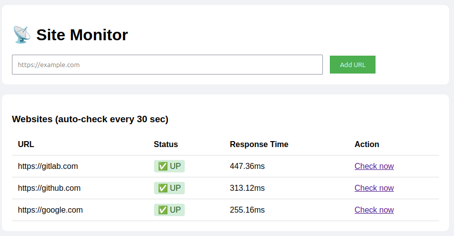
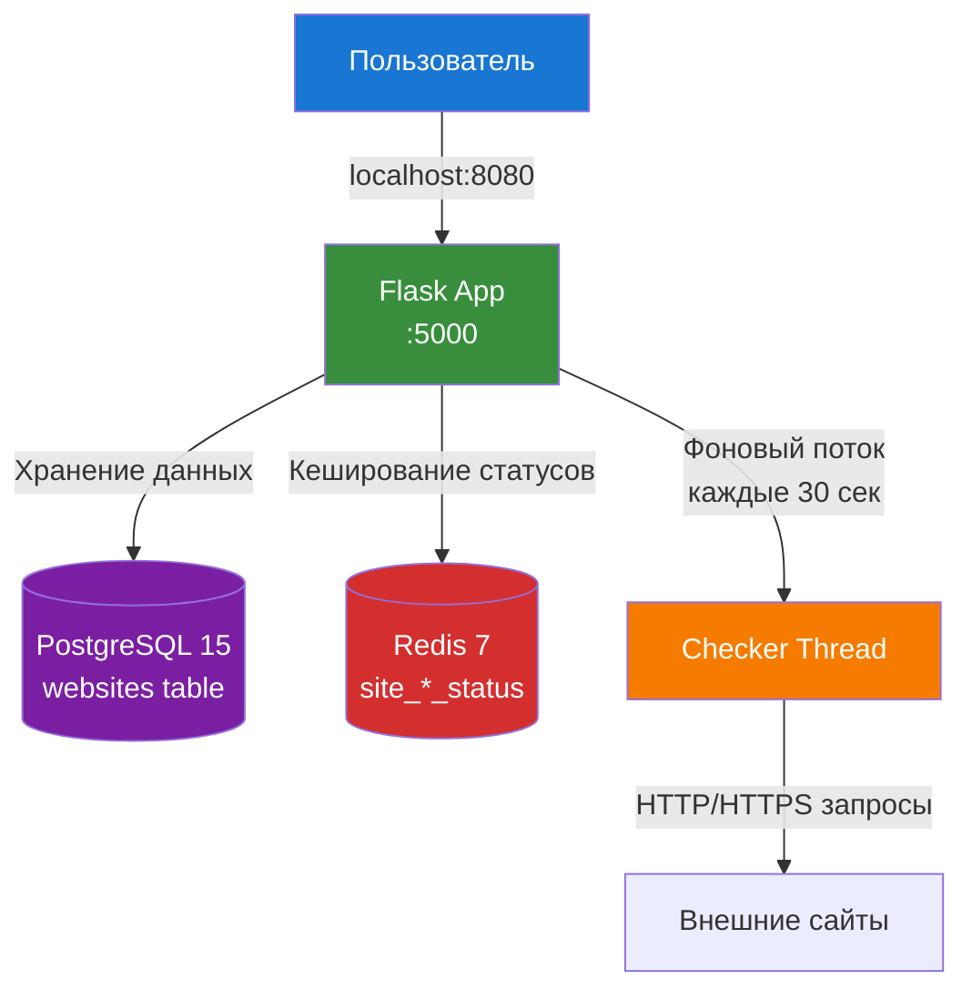

# 📡 Site Monitor - Infrastructure as Code

[](https://www.terraform.io)
[](https://www.docker.com)
[](https://flask.palletsprojects.com)
[](https://www.postgresql.org)
[](https://redis.io)
[](LICENSE)

Веб-приложение для мониторинга доступности сайтов. Добавляем URL и получаем статус UP/DOWN с временем ответа. Вся инфраструктура описывается кодом (IaC) с помощью **Terraform**.

## Оглавление

- [Архитектура](#архитектура)
- [Технологии](#технологии)
- [Быстрый старт](#быстрый-старт)
- [Управление проектом](#управление-проектом)
- [API Endpoints](#api-endpoints)
- [Мониторинг и отладка](#-мониторинг-и-отладка)
- [Лицензия](#-лицензия)

## Интерфейс



## Архитектура



### Компоненты системы

| Компонент | Технология | Назначение |
| :--- | :--- | :--- |
| **Web Server** | Flask (Python 3.11) | Веб-интерфейс и REST API |
| **Database** | PostgreSQL 15 | Хранение списка сайтов и истории проверок |
| **Cache** | Redis 7 | Быстрое кеширование статусов сайтов |
| **Orchestration** | Docker + Terraform | Управление контейнерами как кодом |

## Технологии

| Технология | Версия | Назначение |
| :--- | :--- | :--- |
| **Terraform** | 1.7+ | Infrastructure as Code |
| **Docker** | 24.0+ | Контейнеризация |
| **Flask** | 3.0 | Веб-фреймворк |
| **PostgreSQL** | 15 Alpine | Реляционная БД |
| **Redis** | 7 Alpine | In-memory кеш |
| **Requests** | 2.31 | HTTP проверки сайтов |

## Быстрый старт

**Требования**
- Docker 24.0+
- Terraform 1.7+
- Git

### Установка и запуск

```bash
# 1. Клонировать репозиторий
git clone https://github.com/roman-vercetti/terraform-monitor-app
cd terraform-monitor-app

# 2. Инициализировать Terraform
terraform init

# 3. Просмотреть план изменений
terraform plan

# 4. Развернуть инфраструктуру
terraform apply -auto-approve

# 5. Открыть в браузере
firefox http://localhost:8080
# или
xdg-open http://localhost:8080
```

## Управление проектом

### Полезные команды Terraform

```bash
# Просмотр всех ресурсов
terraform state list

# Просмотр outputs
terraform output

# Детальная информация о ресурсе
terraform state show docker_container.monitor_app

# Обновление состояния
terraform refresh

# Уничтожение всей инфраструктуры
terraform destroy -auto-approve

# Форматирование конфигурации
terraform fmt

# Валидация конфигурации
terraform validate
```

### Управление Docker контейнерами

```bash
# Просмотр статуса контейнеров
docker ps -a | grep monitor

# Логи приложения
docker logs -f monitor-app

# Логи PostgreSQL
docker logs -f monitor-postgres

# Логи Redis
docker logs -f monitor-redis

# Вход в контейнер Flask
docker exec -it monitor-app /bin/bash

# Вход в PostgreSQL
docker exec -it monitor-postgres psql -U admin -d monitor

# Вход в Redis CLI
docker exec -it monitor-redis redis-cli
```

### Работа с базой данных

```bash
# Просмотр всех сайтов
docker exec -it monitor-postgres psql -U admin -d monitor -c "SELECT * FROM websites;"

# Просмотр только активных (UP) сайтов
docker exec -it monitor-postgres psql -U admin -d monitor -c "SELECT url, response_time FROM websites WHERE status = 'UP';"

# Просмотр недоступных (DOWN) сайтов
docker exec -it monitor-postgres psql -U admin -d monitor -c "SELECT url, response_time FROM websites WHERE status = 'DOWN';"

# Очистка таблицы
docker exec -it monitor-postgres psql -U admin -d monitor -c "TRUNCATE websites;"
```

### Работа с Redis кешем

```bash
# Просмотр всех ключей
docker exec -it monitor-redis redis-cli KEYS "*"

# Получить статус конкретного сайта
docker exec -it monitor-redis redis-cli GET "site_1_status"

# Получить время ответа
docker exec -it monitor-redis redis-cli GET "site_1_response_time"

# Очистка всего кеша
docker exec -it monitor-redis redis-cli FLUSHALL
```

## API Endpoints

| Endpoint | Method | Description |
| :--- | :--- | :--- |
| `/` | GET | Главная страница с веб-интерфейсом |
| `/add` | POST | Добавление нового URL |
| `/check/<id>` | GET | Ручная проверка сайта по ID |
| `/health` | GET | Healthcheck для Docker |
| `/api/sites` | GET | JSON список всех сайтов |
| `/api/check/<id>` | GET | JSON результат проверки сайта |

### Примеры API запросов

```bash
# Получить все сайты в JSON
curl http://localhost:8080/api/sites

# Проверить сайт через API
curl http://localhost:8080/api/check/1

# Добавить сайт через API
curl -X POST http://localhost:8080/add -d "url=https://google.com"
```

## Мониторинг и отладка

### Health checks

```bash
# Проверка здоровья приложения
curl http://localhost:8080/health

# Проверка PostgreSQL
docker exec monitor-postgres pg_isready -U admin -d monitor

# Проверка Redis
docker exec monitor-redis redis-cli ping
```

### Логирование

Приложение логирует:

- Успешные и неудачные проверки сайтов
- Ошибки подключения к БД/Redis
- Старт и остановку фонового потока проверок
```bash
# Просмотр логов в реальном времени
docker logs -f monitor-app

# Поиск ошибок в логах
docker logs monitor-app 2>&1 | grep -i error
```

## 📄 Лицензия

MIT License

## 👤 Автор

**Roman Petukhov**

- GitHub: [Roman](https://github.com/roman-vercetti)
- Проект: [docker-counter-project](https://github.com/roman-vercetti/terraform-monitor-app)